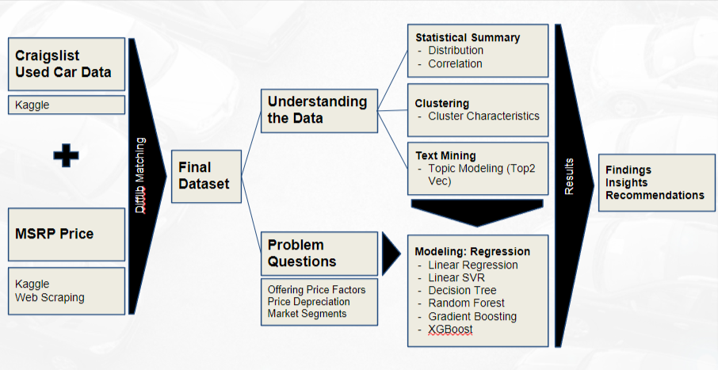

# Used Car Market 

Data Mining project on used car price prediction 

## Team

Ahjeong Yeom, Akhir Syabani, Jessica Addai, Kenji Laurens, Ruofan Yao, Zongyuan Yu


## Project Background

Asymmetric information, also known as “information failure,” takes place during a transaction where one party has greater material knowledge or better information than the other party. This is a problem in some markets where product quality cannot just be observed by the buyer prior to the purchase; such as the used car market. The situation where the sellers have better information than the buyers causes the sellers to have an incentive to present the product/service as being of higher quality than it actually is. This leads to the temptation of sellers to skimp/cheat. With the possibility of skimping from the sellers’ side, buyers become reluctant to pay high prices through the risen expectations of receiving low-quality products, also known as “lemons” (A term coined by George Akerlof, an American economist who won the Nobel Memorial Prize in 2001, wrote “The Market of Lemons: Quality Uncertainty and the Market Mechanism,” a paper about lemons in a market with the presence of asymmetric information and the consequences it comes with).


## Project Flow



## Models 

Linear Regression​

Linear SVR​

Random Forest​

Gradient Boosting Machine​

XGBoost​

## Dataset 
[Used Car Dataset](https://www.kaggle.com/austinreese/craigslist-carstrucks-data​)

[MSRP](https://www.kaggle.com/CooperUnion/cardataset)

[iSeeCar](https://www.iseecars.com/)

## Tools
```bash
pip install top2vec
pip install Scrapy
```
